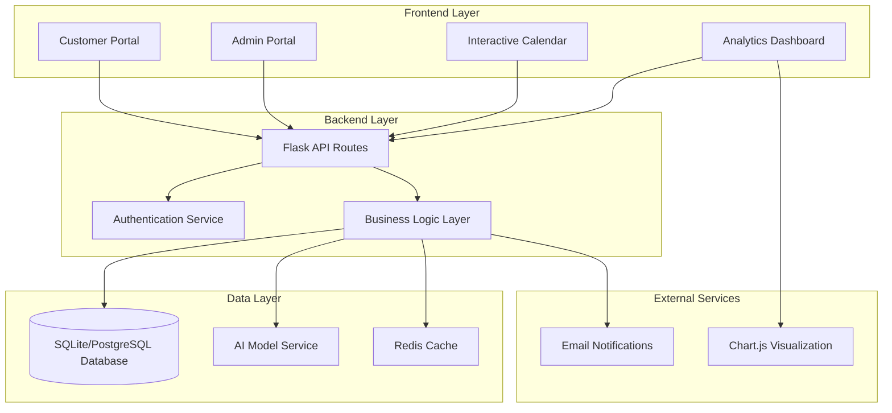

# Design Document

## Overview

The Smart Inventory Management System is a web-based application built with Flask (Python) backend and modern frontend technologies. The system implements a dual-portal architecture with role-based access control, featuring real-time inventory management, AI-driven insights, and interactive data visualization. The application follows MVC architecture patterns with clear separation between data models, business logic, and presentation layers.

## Architecture

### System Architecture


### Technology Stack
- **Backend**: Python Flask with SQLAlchemy ORM
- **Database**: SQLite (development) / PostgreSQL (production)
- **Frontend**: HTML5, CSS3, JavaScript ES6+, Bootstrap 5
- **Authentication**: Flask-Login with session management
- **AI/ML**: Scikit-learn, Pandas, NumPy for demand prediction
- **Visualization**: Chart.js for analytics, FullCalendar.js for calendar
- **Caching**: Redis for session storage and performance optimization
- **Deployment**: Docker containers with Gunicorn WSGI server

## Components and Interfaces

### Core Components

#### 1. Authentication System
```python
# Interface for user authentication
class AuthenticationService:
    def register_user(email, password, role) -> User
    def authenticate_user(email, password) -> bool
    def get_current_user() -> User
    def logout_user() -> bool
    def require_role(role) -> decorator
```

#### 2. Product Management Service
```python
class ProductService:
    def create_product(product_data) -> Product
    def update_product(product_id, updates) -> Product
    def delete_product(product_id) -> bool
    def get_products(filters=None) -> List[Product]
    def check_stock_levels() -> List[LowStockAlert]
    def update_stock(product_id, quantity_change) -> bool
```

#### 3. Purchase Request System
```python
class PurchaseRequestService:
    def create_request(customer_id, product_id, quantity) -> PurchaseRequest
    def approve_request(request_id, admin_id) -> bool
    def reject_request(request_id, admin_id, reason) -> bool
    def get_pending_requests() -> List[PurchaseRequest]
    def get_customer_history(customer_id) -> List[PurchaseRequest]
```

#### 4. AI Prediction Engine
```python
class AIRestockingService:
    def train_model(sales_data) -> None
    def predict_demand(product_id, time_period) -> PredictionResult
    def generate_restock_suggestions() -> List[RestockSuggestion]
    def analyze_seasonal_trends(product_id) -> TrendAnalysis
```

#### 5. Analytics and Reporting
```python
class AnalyticsService:
    def get_sales_summary(date_range) -> SalesSummary
    def get_daily_sales(date) -> List[Sale]
    def generate_calendar_data() -> CalendarData
    def get_dashboard_metrics() -> DashboardMetrics
    def export_sales_report(format, date_range) -> File
```

### API Endpoints

#### Customer Portal APIs
- `GET /api/products` - Get product catalog with search/filter
- `POST /api/purchase-requests` - Submit purchase request
- `GET /api/purchase-requests/history` - Get customer purchase history
- `GET /api/products/search` - Search products by name/category

#### Admin Portal APIs
- `POST /api/admin/products` - Create new product
- `PUT /api/admin/products/{id}` - Update product
- `DELETE /api/admin/products/{id}` - Delete product
- `GET /api/admin/purchase-requests` - Get pending requests
- `POST /api/admin/purchase-requests/{id}/approve` - Approve request
- `POST /api/admin/purchase-requests/{id}/reject` - Reject request
- `GET /api/admin/analytics/dashboard` - Get dashboard data
- `GET /api/admin/analytics/calendar` - Get calendar sales data
- `GET /api/admin/ai/suggestions` - Get AI restock suggestions
- `GET /api/admin/customers` - Get customer management data

## Data Models

### Database Schema

#### Users Table
```sql
CREATE TABLE users (
    id INTEGER PRIMARY KEY AUTOINCREMENT,
    email VARCHAR(120) UNIQUE NOT NULL,
    password_hash VARCHAR(255) NOT NULL,
    role ENUM('customer', 'admin') NOT NULL,
    first_name VARCHAR(80) NOT NULL,
    last_name VARCHAR(80) NOT NULL,
    created_at TIMESTAMP DEFAULT CURRENT_TIMESTAMP,
    is_active BOOLEAN DEFAULT TRUE
);
```

#### Products Table
```sql
CREATE TABLE products (
    id INTEGER PRIMARY KEY AUTOINCREMENT,
    name VARCHAR(200) NOT NULL,
    description TEXT,
    category VARCHAR(100) NOT NULL,
    cost_price DECIMAL(10,2) NOT NULL,
    selling_price DECIMAL(10,2) NOT NULL,
    quantity INTEGER NOT NULL DEFAULT 0,
    low_stock_threshold INTEGER DEFAULT 10,
    created_at TIMESTAMP DEFAULT CURRENT_TIMESTAMP,
    updated_at TIMESTAMP DEFAULT CURRENT_TIMESTAMP
);
```

#### Purchase Requests Table
```sql
CREATE TABLE purchase_requests (
    id INTEGER PRIMARY KEY AUTOINCREMENT,
    customer_id INTEGER NOT NULL,
    product_id INTEGER NOT NULL,
    quantity INTEGER NOT NULL,
    status ENUM('pending', 'approved', 'rejected') DEFAULT 'pending',
    admin_id INTEGER,
    rejection_reason TEXT,
    requested_at TIMESTAMP DEFAULT CURRENT_TIMESTAMP,
    processed_at TIMESTAMP,
    FOREIGN KEY (customer_id) REFERENCES users(id),
    FOREIGN KEY (product_id) REFERENCES products(id),
    FOREIGN KEY (admin_id) REFERENCES users(id)
);
```

#### Sales Table
```sql
CREATE TABLE sales (
    id INTEGER PRIMARY KEY AUTOINCREMENT,
    purchase_request_id INTEGER NOT NULL,
    product_id INTEGER NOT NULL,
    customer_id INTEGER NOT NULL,
    quantity INTEGER NOT NULL,
    unit_price DECIMAL(10,2) NOT NULL,
    total_amount DECIMAL(10,2) NOT NULL,
    sale_date TIMESTAMP DEFAULT CURRENT_TIMESTAMP,
    FOREIGN KEY (purchase_request_id) REFERENCES purchase_requests(id),
    FOREIGN KEY (product_id) REFERENCES products(id),
    FOREIGN KEY (customer_id) REFERENCES users(id)
);
```

#### AI Predictions Table
```sql
CREATE TABLE ai_predictions (
    id INTEGER PRIMARY KEY AUTOINCREMENT,
    product_id INTEGER NOT NULL,
    predicted_demand INTEGER NOT NULL,
    confidence_score DECIMAL(3,2) NOT NULL,
    prediction_period VARCHAR(20) NOT NULL,
    created_at TIMESTAMP DEFAULT CURRENT_TIMESTAMP,
    FOREIGN KEY (product_id) REFERENCES products(id)
);
```

### Data Models (Python Classes)

#### User Model
```python
class User(db.Model):
    id = db.Column(db.Integer, primary_key=True)
    email = db.Column(db.String(120), unique=True, nullable=False)
    password_hash = db.Column(db.String(255), nullable=False)
    role = db.Column(db.Enum('customer', 'admin'), nullable=False)
    first_name = db.Column(db.String(80), nullable=False)
    last_name = db.Column(db.String(80), nullable=False)
    created_at = db.Column(db.DateTime, default=datetime.utcnow)
    is_active = db.Column(db.Boolean, default=True)
```

#### Product Model
```python
class Product(db.Model):
    id = db.Column(db.Integer, primary_key=True)
    name = db.Column(db.String(200), nullable=False)
    description = db.Column(db.Text)
    category = db.Column(db.String(100), nullable=False)
    cost_price = db.Column(db.Decimal(10,2), nullable=False)
    selling_price = db.Column(db.Decimal(10,2), nullable=False)
    quantity = db.Column(db.Integer, nullable=False, default=0)
    low_stock_threshold = db.Column(db.Integer, default=10)
    created_at = db.Column(db.DateTime, default=datetime.utcnow)
    updated_at = db.Column(db.DateTime, default=datetime.utcnow, onupdate=datetime.utcnow)
```

## Error Handling

### Error Response Format
```json
{
    "error": {
        "code": "VALIDATION_ERROR",
        "message": "Invalid input data",
        "details": {
            "field": "quantity",
            "reason": "Must be greater than 0"
        }
    },
    "timestamp": "2024-01-15T10:30:00Z",
    "request_id": "req_123456"
}
```

### Error Categories
1. **Authentication Errors** (401, 403)
   - Invalid credentials
   - Insufficient permissions
   - Session expired

2. **Validation Errors** (400)
   - Invalid input format
   - Missing required fields
   - Business rule violations

3. **Resource Errors** (404, 409)
   - Product not found
   - Insufficient stock
   - Duplicate entries

4. **System Errors** (500)
   - Database connection issues
   - AI model prediction failures
   - External service unavailable

### Error Handling Strategy
- Global exception handler for unhandled errors
- Input validation using Flask-WTF forms
- Database transaction rollback on errors
- Graceful degradation for AI service failures
- User-friendly error messages in frontend
- Comprehensive logging for debugging

## Testing Strategy

### Unit Testing
- **Models**: Test data validation, relationships, and business logic
- **Services**: Test business logic methods with mocked dependencies
- **API Endpoints**: Test request/response handling and status codes
- **AI Components**: Test prediction accuracy with sample datasets

### Integration Testing
- **Database Operations**: Test CRUD operations with real database
- **Authentication Flow**: Test login/logout and role-based access
- **Purchase Workflow**: Test end-to-end request approval process
- **AI Integration**: Test model training and prediction pipeline

### Frontend Testing
- **Component Testing**: Test individual UI components
- **User Flow Testing**: Test complete user journeys
- **Cross-browser Testing**: Ensure compatibility across browsers
- **Responsive Design Testing**: Test mobile and desktop layouts

### Performance Testing
- **Load Testing**: Test system under concurrent user load
- **Database Performance**: Test query optimization and indexing
- **AI Model Performance**: Test prediction response times
- **Caching Effectiveness**: Test Redis cache hit rates

### Security Testing
- **Authentication Testing**: Test login security and session management
- **Authorization Testing**: Test role-based access controls
- **Input Validation Testing**: Test against injection attacks
- **Data Protection Testing**: Test sensitive data handling

### Test Environment Setup
- Separate test database with sample data
- Mocked external services for isolated testing
- Automated test execution in CI/CD pipeline
- Test coverage reporting and quality gates